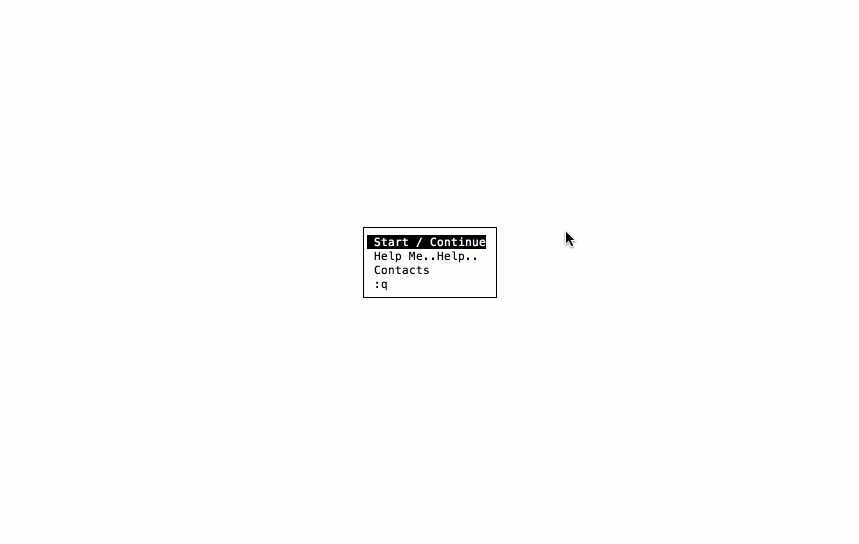
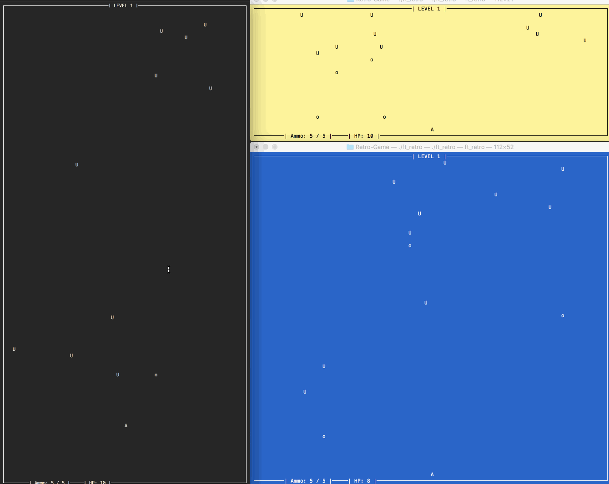

# RETRO

Just a retro-style console mini-game written on C++ using ncurses.
> There are some placeholders for sounds (just search for `sound` word). \
> So don't hesitate to add some code and make a pull request! :) 

### Usage

```bash
$> make
$> ./ft_retro
```

> Please make sure your terminal window is not small.  
> Also, there is no dynamic resize window support. At least yet. :)


Try to run it in different form factors of the terminal, different color schemes.




Thank you!
